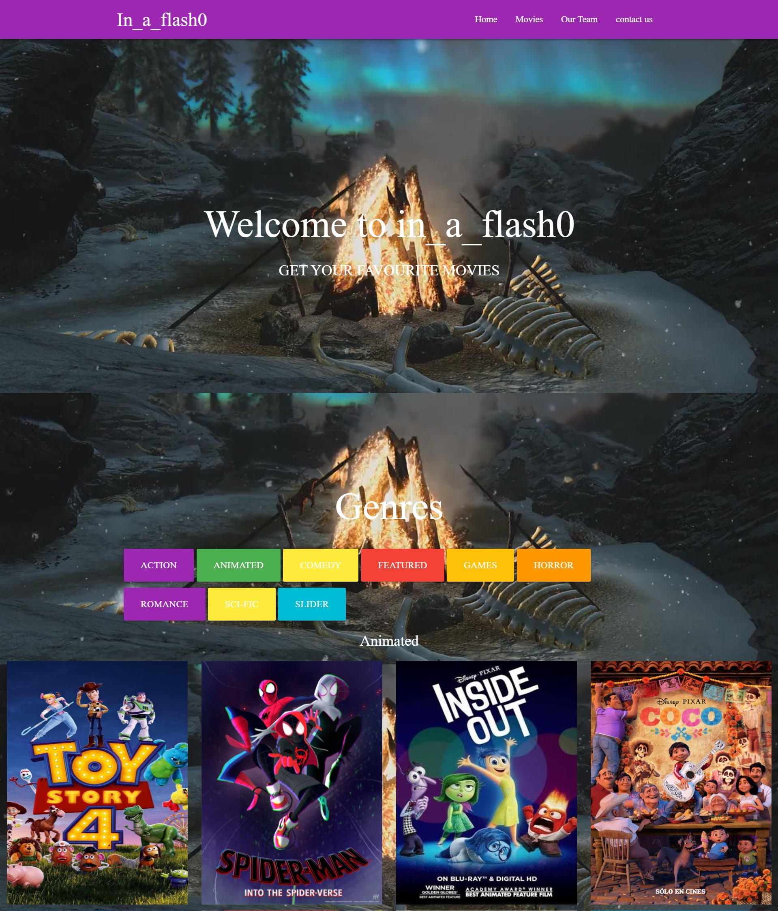

# in_a_flash0.github.io

```diff 
+ Under  Construction 
``` 

<!-------->
<h1>Hey..! 🧑‍⚕️ </h1>
<p>Welcome to Plasma Donor project. As we all know, we are facing a global pandemic named as COVID-19. Scientists are trying to discover vaccines to cure people affected with corona virus. In this critical situation different types of treatments are given by different doctors. Some doctors recommended plasma therapy for the patient who is in the critical situation. In this situation it is difficult for a patient to find a donor as everybody can’t donate plasma.</p>


in_a_flash0 Movies

